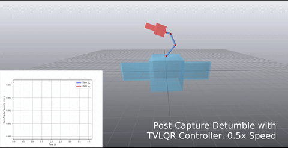

# Post Capture Detumble Trajectory Optimization

This repository contains the code for Post-capture detumble trajectory stabilization for robotic active debris removal

The `PostCapDetumbleTrajectory` class is provided in the file `PostCapDetumbleTrajOpt.py`. The `TVLQRTrajectoryStabilizer` class is provided in the file `TrajectoryStabilizationTVLQR.py`. Example use of these classes can be seen in the application folder `asr_paper_system`.

<div align="center">

</div>

## Depencencies

The repository has the following dependencies:

- numpy
- Drake (<https://drake.mit.edu/>) (Install via apt or tarball as *SNOPT* is not installed via pip and this solver is used for trajectory optimization)
- toml
- matplotlib
- pickle

## Folder Organization

- `asr_paper_system`: Contains the code for the system used in the following paper: [*Vyas, S., Maywald, L., Kumar, S., Jankovic, M., Mueller, A. and Kirchner, F., 2022. Post-capture detumble trajectory stabilization for robotic active debris removal. Advances in Space Research.*](https://www.sciencedirect.com/science/article/pii/S0273117722008742)

DOI: 10.1016/j.asr.2022.09.033

Bibtex:

```
@article{VYAS2022,
  dimensions = {true},
  title = {Post-capture detumble trajectory stabilization for robotic active debris removal},
  journal = {Advances in Space Research},
  year = {2022},
  issn = {0273-1177},
  doi = {10.1016/j.asr.2022.09.033},
  url = {https://www.sciencedirect.com/science/article/pii/S0273117722008742},
  author = {Vyas, Shubham and Maywald, Lasse and Kumar, Shivesh and Jankovic, Marko and Mueller, Andreas and Kirchner, Frank},
  keywords = {Active debris removal, Space robotics, Trajectory stabilization},
  month = sep
}
```

## Acknowledgements

This research was conducted within Stardust Reloaded project which has received funding from the European Union’s Horizon 2020 research and innovation programme under the Marie Skłodowska-Curie grant agreement No 813644.
